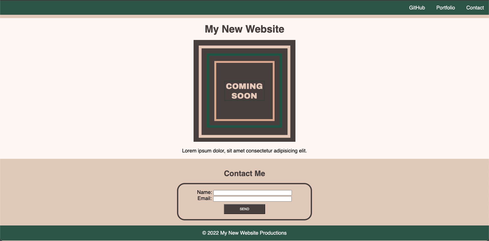

# Module 01 Mini-Project: Landing Page

In this mini-project, I had to build a landing page using HTML and CSS, making sure it included the following elements: header and footer, image with a caption and a contact form.

## Screenshot

## Deployment

https://sarasg89.github.io/Module01-Mini-Project/

## Credits

© 2022 edX Boot Camps LLC. Confidential and Proprietary. All Rights Reserved.
